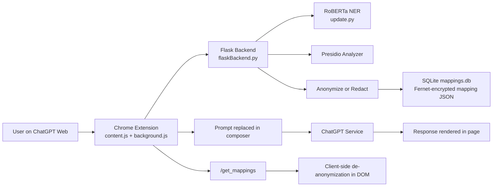

# SSS Secure Shielding Service


**Privacy-first protection for AI interactions through real-time PII detection, anonymization, and pseudonymization.**

SSS (Secure Shielding Service) is a browser-extension-driven privacy layer that processes prompt text before it is sent to supported AI services. It combines backend PII detection with configurable anonymization/redaction and mapping-based de-anonymization.

## Project Overview

SSS helps reduce accidental exposure of sensitive information in AI prompts.

```text
User Input
    ↓
Browser Extension Interception
    ↓
PII Detection (RoBERTa + Presidio)
    ↓
Anonymization / Pseudonymization / Redaction
    ↓
AI Service (current implementation: ChatGPT web)
    ↓
Response in Browser
    ↓
Mapping-based De-anonymization (when mappings exist)
    ↓
User
```

## Why SSS?

Users often share names, emails, phone numbers, addresses, and other identifiers while interacting with LLMs. SSS introduces a preprocessing layer so that sensitive values can be transformed before prompts are submitted.

## Key Features (Verified)

- **Prompt anonymization endpoint** via Flask (`/anonymize`) with configurable mode (`fake` or `redact`)
- **PII detection pipeline** using:
  - Microsoft Presidio (`presidio_analyzer`, `presidio_anonymizer`)
  - RoBERTa NER pipeline (`Jean-Baptiste/roberta-large-ner-english`) through `update.py`
- **Custom recognizers** for Aadhaar, financial account patterns, SSN, phone, and URL
- **Pseudonymization with Faker** for realistic replacements (name/email/phone/location/etc.)
- **Redaction mode** with deterministic `[REDACTED_<ENTITY>_<index>]` placeholders
- **Encrypted mapping storage** in SQLite (`mappings.db`) using Fernet key material (`SECRET.key` generated locally)
- **De-anonymization endpoint** (`/deanonymize`) that restores values using stored mappings
- **Mapping retrieval endpoint** (`/get_mappings`) used by the extension for in-page restoration
- **Config endpoint** (`/config`) for selected sites/models/methods/PII categories
- **Health endpoint** (`/health`) for service status checks
- **Background cleanup thread** that removes mapping rows older than 24 hours
- **Dockerized backend** via `Dockerfile` and `docker-compose.yml`

## Architecture




## Privacy Pipeline

1. User writes a prompt in ChatGPT.
2. Extension button triggers processing and sends prompt text + URL to backend.
3. Backend detects entities via RoBERTa and Presidio/custom recognizers.
4. Backend applies configured transformation:
   - **Anonymization/Pseudonymization** (`fake`): replace with generated fake values.
   - **Redaction** (`redact`): replace with redaction placeholders.
5. Backend stores reverse mappings (encrypted) in SQLite.
6. Extension updates prompt text in the ChatGPT input box.
7. Extension fetches mappings and applies de-anonymization to visible chat content when matches exist.

### Terminology

- **Anonymization**: transforms sensitive content before sending.
- **Pseudonymization**: replaces sensitive values with realistic substitutes while storing a mapping.
- **Redaction**: masks/removes sensitive values with redaction tokens.

## Technology Stack

| Layer | Technology |
|---|---|
| Browser Extension | JavaScript, Chrome Extension Manifest V3 APIs |
| Backend | Python, Flask, flask-cors |
| PII Detection | Microsoft Presidio + custom regex recognizers |
| ML Entity Detection | Hugging Face Transformers RoBERTa NER pipeline |
| Fake Data Generation | Faker |
| Mapping Storage | SQLite (`mappings.db`) |
| Mapping Protection | `cryptography` Fernet symmetric encryption |
| Containerization | Docker, Docker Compose |
| QA / Evaluation Scripts | Python scripts (`run_qa_tests.py`, `test_1000_data.py`, `calculate_accuracy.py`) |

## Supported AI Platforms (Current Implementation)

Based on `manifest.json` host/content script matches and `content.js` selectors:

- **ChatGPT Web** (`https://chatgpt.com/*`, `https://chat.openai.com/*`)

Notes:
- Popup UI includes disabled options for Claude and Gemini, but they are not active integration targets in current extension behavior.

## Browser Support

The extension is implemented using **Chrome Extension Manifest V3** and Chromium APIs (`chrome.runtime`, `chrome.storage`, service worker background script).

> Compatibility is expected for Chromium-based browsers that support MV3, but should be validated per browser/version before production use.

## Project Structure

```text
SSS-Secure-Shielding-Service/
├── background.js
├── content.js
├── flaskBackend.py
├── manifest.json
├── popup/
│   ├── popup.html
│   ├── popup.js
│   └── popup.css
├── icons/
│   └── icon16.png
├── mappings/
│   └── chatgpt.json
├── training/
│   ├── prompt.ipynb
│   ├── tokenizer.pkl
│   ├── tf_prompt_optimizer_enc.weights.h5
│   ├── tf_prompt_optimizer_dec.weights.h5
│   └── tf_transformer_prompt_optimizer.h5
├── update.py
├── run_qa_tests.py
├── test_1000_data.py
├── calculate_accuracy.py
├── test_ocr.py
├── test_ocr_api.py
├── test_pdf_scan.py
├── Dockerfile
├── docker-compose.yml
├── requirements.txt
└── README.md
```

## Installation

### Prerequisites

- Python 3.10+ (Dockerfile uses Python 3.10 slim)
- pip
- Google Chrome (or another MV3-capable Chromium browser)
- Git
- Optional: Docker + Docker Compose

### Clone Repository

```bash
git clone https://github.com/Shashankss1205/SSS-Secure-Shielding-Service.git
cd SSS-Secure-Shielding-Service
```

### Python Environment Setup

```bash
python -m venv .venv
```

```bash
# Windows
.venv\Scripts\activate

# Linux/macOS
source .venv/bin/activate
```

```bash
pip install -r requirements.txt
```

## Backend Configuration

- `FLASK_PORT` (optional): backend port (defaults to `5000` in `flaskBackend.py`)
- `FLASK_ENV` is set to `production` in `docker-compose.yml`

The backend also generates/loads a local encryption key file named `SECRET.key` for mapping encryption.

> Do not commit `.env`, `SECRET.key`, database files, or logs.

## Run the Backend

```bash
python flaskBackend.py
```

Default URL:

```text
http://localhost:5000
```

Health check:

```text
GET /health
```

## Browser Extension Setup

1. Start the backend service first.
2. Open browser extension management (`chrome://extensions/`).
3. Enable **Developer mode**.
4. Click **Load unpacked**.
5. Select the repository root directory (contains `manifest.json`).
6. Confirm extension appears in the toolbar.
7. Open `https://chatgpt.com`.
8. Enter non-sensitive sample text and click the extension’s injected processing button.

## Docker

The provided container setup runs the Flask backend.

```bash
docker compose up --build
```

This starts service `sss-backend` and maps port `5000:5000`.

## API Endpoints (Implemented)

- `GET /health` — service health
- `POST /config` — update anonymization configuration
- `POST /anonymize` — detect + transform PII in text
- `GET /get_mappings` — retrieve stored mappings grouped by URL
- `POST /deanonymize` — restore anonymized text from mappings

## Testing and Evaluation

Available scripts:

- `run_qa_tests.py` — backend API behavior checks (health/config/anonymize/deanonymize)
- `test_1000_data.py` — larger-volume anonymize/deanonymize flow test using Faker data
- `calculate_accuracy.py` — computes precision/recall/F1 from synthetic generated sentences
- `test_ocr.py`, `test_ocr_api.py`, `test_pdf_scan.py` — experimental OCR-related scripts

Example:

```bash
python run_qa_tests.py
```

> Many scripts expect the backend running at `http://localhost:5000`.

## Security & Privacy Considerations

- Never commit API keys, tokens, `.env`, `SECRET.key`, `mappings.db`, or logs.
- Mapping data can contain sensitive reconstruction context; treat DB and key as sensitive.
- Use HTTPS and hardened runtime configuration for production deployments.
- Review extension permissions and host permissions before deploying broadly.
- Use synthetic/non-sensitive data for testing whenever possible.
- Rotate credentials/keys immediately if exposed.

## Limitations

- PII detection quality depends on model/regex behavior and input context.
- Current extension integration is focused on ChatGPT web flows.
- DOM selectors may need updates as AI website UIs change.
- RoBERTa model loading can be resource-intensive on first run.
- Popup currently sends `/status` and `getSettings` calls that are not implemented as backend/background handlers in this codebase.
- Production deployment needs additional hardening (auth, observability, secret management, environment isolation).

## Roadmap

Planned directions reflected by current project intent:

- Expand integrations beyond current ChatGPT-targeted workflow
- Add richer custom anonymization rule controls
- Improve performance/latency under larger prompt volumes
- Strengthen enterprise deployment patterns and operational controls
- Improve model evaluation and reproducibility pipeline

## Contributing

1. Fork the repository.
2. Create a feature branch.
3. Make your changes.
4. Add/update tests where applicable.
5. Validate locally.
6. Open a pull request.

## Responsible Use

SSS is a privacy-enhancement layer, not a guarantee of complete anonymity or security. Always review transformed content before submitting sensitive information to external AI services.

## License

This project is licensed under the Apache License 2.0. See the [LICENSE](LICENSE) file for details.

## Acknowledgements

- [Flask](https://flask.palletsprojects.com/)
- [Microsoft Presidio](https://microsoft.github.io/presidio/)
- [Hugging Face Transformers](https://huggingface.co/docs/transformers/index)
- [Faker](https://faker.readthedocs.io/)
- [Chrome Extensions API](https://developer.chrome.com/docs/extensions/)
