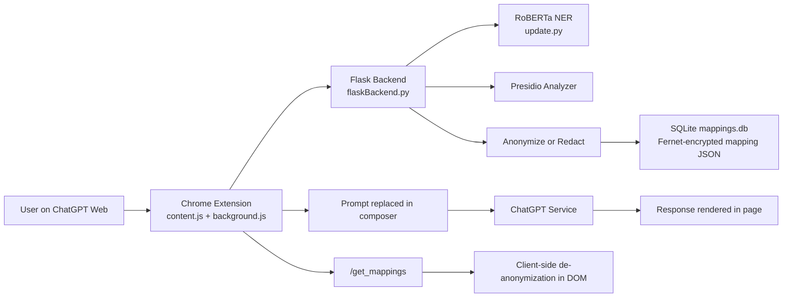

# SSS Secure Shielding Service


Privacy-first protection for AI interactions through real-time PII detection, anonymization, pseudonymization, and redaction.

SSS (Secure Shielding Service) is a Chrome extension and Flask-based privacy layer that processes sensitive prompt content before it is submitted to supported AI services. It combines Microsoft Presidio, RoBERTa-based NER, custom recognizers, configurable anonymization/redaction, and encrypted mapping storage to reduce accidental exposure of personally identifiable information (PII).

---

## Overview

SSS operates as an inline security boundary between users and web-based AI platforms. When a user submits text containing sensitive credentials or personal identifiers, SSS automatically intercepts, detects, and transforms PII into safe pseudonyms or redaction tokens before the prompt reaches external AI servers.

## Problem Statement

As artificial intelligence platforms become central to daily workflows, users frequently copy and paste proprietary code, financial records, government identification numbers, medical information, and personal details into public LLM interfaces. Unsanitized prompt data risks exposure through data logging, model training pipelines, or potential third-party security breaches.

## Solution

SSS provides a non-intrusive, automated shielding layer:
1. **Client-Side Interception**: A lightweight Chrome Extension captures prompts inside supported web interfaces.
2. **Hybrid PII Detection**: A robust backend combines deep learning (RoBERTa NER) with pattern recognition (Microsoft Presidio + custom rules).
3. **Reversible Shielding**: Sensitive values are replaced with realistic pseudonyms or redaction placeholders while storing Fernet-encrypted mappings in SQLite.
4. **Contextual In-Page Restoration**: Client-side de-anonymization dynamically restores original values in the rendered web interface for seamless user interaction.

## Key Features

- **Multi-Method PII Detection**:
  - Microsoft Presidio (`presidio_analyzer`, `presidio_anonymizer`)
  - Deep learning RoBERTa NER pipeline (`Jean-Baptiste/roberta-large-ner-english`)
  - Custom recognizers for Aadhaar, financial accounts, SSN, phone numbers, and URLs
- **Configurable Transformation Modes**:
  - **Pseudonymization (`fake`)**: Replaces entities with realistic fake data via Faker (names, emails, addresses).
  - **Redaction (`redact`)**: Replaces entities with deterministic `[REDACTED_<ENTITY>_<INDEX>]` placeholders.
- **Encrypted Mapping Storage**:
  - Encrypts mapping dictionaries using AES-256 Fernet symmetric keys (`SECRET.key`).
  - Stores mapping metadata in SQLite (`mappings.db`) with automatic 24-hour retention cleanup.
- **RESTful Backend APIs**:
  - `/anonymize`, `/deanonymize`, `/get_mappings`, `/config`, `/health`
- **Dockerized Deployment**:
  - Production-ready `Dockerfile` and `docker-compose.yml` for isolated container execution.

## Architecture



## Privacy Pipeline

1. **User Action**: User enters prompt text in ChatGPT Web.
2. **Interception**: Extension intercepts submission and forwards payload to backend `/anonymize`.
3. **Entity Extraction**: Backend runs Presidio analyzer and RoBERTa NER to extract sensitive entities.
4. **Transformation**: Replaces detected values with pseudonyms or redaction tokens based on active configuration.
5. **Encrypted Mapping**: Stores original-to-shielded mapping in `mappings.db` encrypted with Fernet.
6. **Prompt Substitution**: Extension updates the input area with transformed text for submission.
7. **Client De-anonymization**: Extension queries `/get_mappings` to restore original terms locally in rendered DOM responses.

### Terminology

- **Anonymization**: General process of obscuring personal identifiers.
- **Pseudonymization**: Substituting sensitive values with realistic fake data while maintaining reverse mappings.
- **Redaction**: Permanently or temporarily replacing identifiers with static tokens without preserving original values in prompt text.

## Project Structure

```text
SSS-Secure-Shielding-Service/
├── extension/       # Chrome Extension (Manifest V3)
│   ├── manifest.json
│   ├── background.js
│   ├── content.js
│   ├── popup/       # Extension popup UI & controls
│   ├── icons/       # Extension toolbar icons
│   └── mappings/    # Default site selector mappings
├── backend/         # Flask Privacy Backend
│   ├── flaskBackend.py   # Primary Flask API server
│   ├── update.py         # RoBERTa PII extraction engine
│   ├── requirements.txt  # Backend dependencies
│   ├── Dockerfile        # Container image definition
│   └── docker-compose.yml # Container orchestration
├── ml/              # Machine Learning Resources
│   └── training/    # Model fine-tuning notebooks & weights
├── tests/           # Functional & Integration Tests
│   ├── run_qa_tests.py
│   ├── test_ocr.py
│   ├── test_ocr_api.py
│   └── test_pdf_scan.py
├── evaluation/      # Accuracy Evaluation & Benchmarks
│   ├── calculate_accuracy.py
│   ├── test_1000_data.py
│   ├── generate_graphs.py
│   └── results/     # Benchmark output graphs
│       ├── accuracy_graph.png
│       ├── comprehensive_comparison_graph.png
│       └── loss_graph.png
├── .gitignore       # Repository exclusion rules
├── LICENSE          # Apache License 2.0
└── README.md        # Technical project documentation
```

### Directory Descriptions

- **`extension/`**: Contains the Manifest V3 browser extension scripts, popup interface, and content script rules.
- **`backend/`**: Contains the Flask API server, Presidio/RoBERTa PII detection engine, Docker configuration, and requirements.
- **`ml/`**: Stores Jupyter notebooks, model weights, and training datasets for ML prompt optimization experiments.
- **`tests/`**: Functional test suite for API endpoints, OCR utilities, and document scanning verification.
- **`evaluation/`**: Benchmarking scripts and generated metric visualization charts.

## Technology Stack

| Layer | Technology |
|---|---|
| **Browser Extension** | JavaScript (ES6+), Chrome Extension Manifest V3 |
| **Backend Framework** | Python 3.10+, Flask, flask-cors |
| **PII Detection** | Microsoft Presidio Analyzer & Anonymizer, Regex Recognizers |
| **Deep Learning NER** | Hugging Face Transformers (`Jean-Baptiste/roberta-large-ner-english`) |
| **Data Pseudonymization** | Faker |
| **Encryption & Storage** | SQLite (`mappings.db`), `cryptography` Fernet AES-256 |
| **Containerization** | Docker, Docker Compose |
| **Evaluation & Plotting** | Matplotlib, NumPy, Requests |

## Supported AI Platforms

Current implementation targets:
- **ChatGPT Web** (`https://chatgpt.com/*`, `https://chat.openai.com/*`)

> *Note*: The popup UI displays UI toggles for additional platforms (Claude, Gemini), which are reserved for future extension releases.

## Browser Compatibility

Tested and supported on **Chromium-based browsers** supporting Manifest V3 (Google Chrome, Brave, Microsoft Edge).

## Prerequisites

- **Python**: 3.10 or higher
- **Browser**: Chrome / Chromium (MV3 support)
- **Containerization (Optional)**: Docker & Docker Compose
- **Package Manager**: `pip`

## Installation

### 1. Clone Repository

```bash
git clone https://github.com/Mithun-veerabuthiran/SSS-Secure-Shielding-Service.git
cd SSS-Secure-Shielding-Service
```

### 2. Backend Setup

Create and activate a virtual environment:

```bash
# Create virtual environment
python -m venv .venv

# Activate on Windows (PowerShell / CMD)
.venv\Scripts\activate

# Activate on Linux / macOS
source .venv/bin/activate

# Install backend dependencies
pip install -r backend/requirements.txt
```

Download spaCy language model for Presidio:
```bash
python -m spacy download en_core_web_lg
```

### 3. Chrome Extension Setup

1. Open Google Chrome and navigate to `chrome://extensions/`.
2. Enable **Developer mode** (toggle switch in the top right).
3. Click **Load unpacked**.
4. Select the `extension/` directory inside `SSS-Secure-Shielding-Service`.
5. Verify that **LLM Data Anonymizer** appears in your active extensions.

## Running the Application

### Backend

To start the backend server locally:

```bash
python backend/flaskBackend.py
```

The backend starts at `http://localhost:5000`. You can verify health status by visiting `http://localhost:5000/health`.

### Chrome Extension

1. Ensure the Flask backend is running on `http://localhost:5000`.
2. Open `https://chatgpt.com`.
3. Type a prompt containing sample PII (e.g., *"My name is John Doe, email john@example.com"*).
4. Click the injected SSS action button in the prompt box to shield your input before submitting.

## Docker Deployment

Alternatively, run the backend inside a Docker container:

```bash
# From repository root
docker compose -f backend/docker-compose.yml up --build
```

This starts the `sss-backend` container on port `5000` with volume-mapped database storage.

## Configuration

The backend supports runtime configuration updates via `POST /config`:

- **Sites**: Select active platform targets
- **Models**: Select detection models (`Presidio`, `RoBERTa`)
- **Methods**: Select transformation mode (`Pseudonymization`, `Redaction`)
- **PIIs**: Configure entity categories (Names, Emails, Phone Numbers, Addresses, Credit Cards, SSN, Aadhaar, URLs)

## API Endpoints

- **`GET /health`**: Returns backend service health status (`{"status": "ok"}`).
- **`POST /config`**: Configures active PII detection categories and modes.
- **`POST /anonymize`**: Accepts prompt text and returns anonymized/redacted text + encrypted mappings.
- **`GET /get_mappings`**: Retrieves active de-anonymization mappings for extension rendering.
- **`POST /deanonymize`**: Restores anonymized text back to original values using session mappings.

## Testing

Run backend functional QA tests:

```bash
python tests/run_qa_tests.py
```

Run OCR document scanning experiments:

```bash
python tests/test_pdf_scan.py
```

## Evaluation

Run benchmark evaluation and generate metric graphs:

```bash
# Evaluate extraction accuracy metrics
python evaluation/calculate_accuracy.py

# Generate metric comparison graphs
python evaluation/generate_graphs.py
```

Graphs are output to `evaluation/results/` (`accuracy_graph.png`, `loss_graph.png`, `comprehensive_comparison_graph.png`).

## Security and Privacy Considerations

- **Secret Key Protection**: `SECRET.key` is auto-generated locally for Fernet encryption and MUST NOT be committed to version control.
- **Database Hygiene**: `mappings.db` contains encrypted reverse mappings and is excluded from Git.
- **Retention**: A background thread automatically purges expired mappings after 24 hours.
- **Sanitized Testing**: Use synthetic data during testing and evaluation.

## Limitations

- Detection accuracy depends on model context and pattern recognizers.
- Dynamic web UI DOM selectors for ChatGPT may require updates if platform layouts change.
- Initial load of deep learning models (RoBERTa) requires sufficient RAM and CPU/GPU resources.

## Roadmap

- Expand extension integration to Claude Web and Google Gemini Web.
- Introduce client-side custom regex rule builder in extension popup.
- Add local LLM support for offline prompt anonymization.
- Support enterprise single sign-on (SSO) and centralized DLP policy management.

## Contributing

1. Fork the repository.
2. Create a feature branch (`git checkout -b feature/amazing-feature`).
3. Commit your changes (`git commit -m 'Add amazing feature'`).
4. Push to the branch (`git push origin feature/amazing-feature`).
5. Open a Pull Request.

## Responsible Use

SSS is a privacy-enhancement utility designed to mitigate accidental data exposure. It is not a replacement for enterprise security compliance audits or absolute security guarantees.

## License

This project is licensed under the Apache License 2.0. See the [LICENSE](LICENSE) file for details.

## Acknowledgements

- [Flask](https://flask.palletsprojects.com/)
- [Microsoft Presidio](https://microsoft.github.io/presidio/)
- [Hugging Face Transformers](https://huggingface.co/docs/transformers/index)
- [Faker](https://faker.readthedocs.io/)
- [Chrome Extensions API](https://developer.chrome.com/docs/extensions/)
