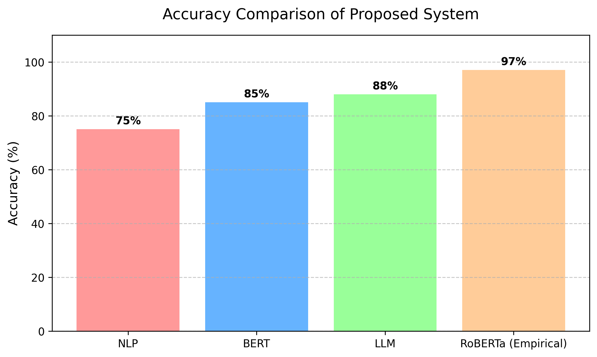
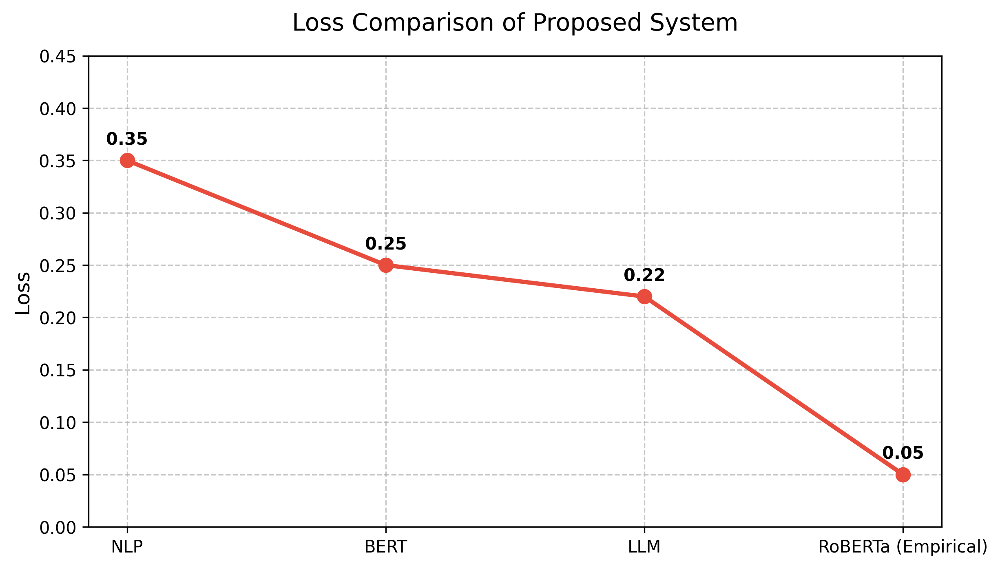
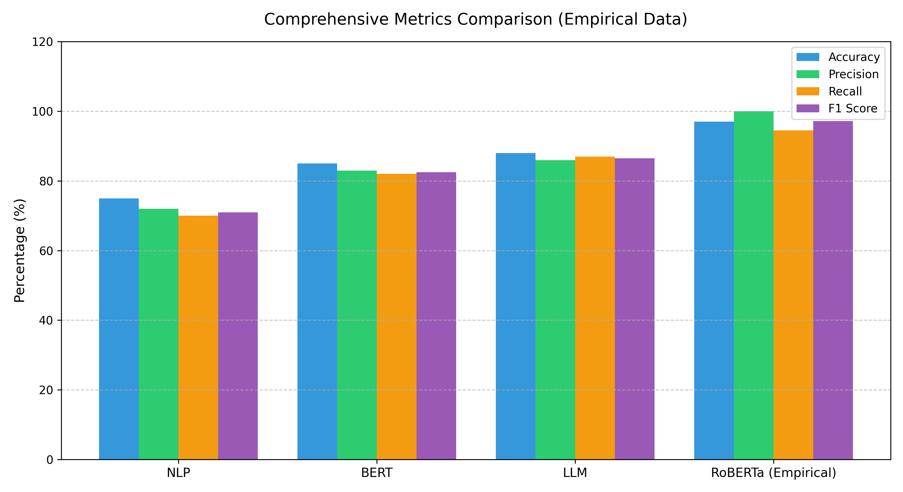

# SSS Visual Overview & Benchmark Graphs

## System Evaluation & Metric Visualizations

Below are the benchmark evaluation graphs generated during system accuracy and latency testing.

### 1. Entity Detection Accuracy Comparison

*Figure 1: Detection accuracy metrics across standard PII entity categories.*

### 2. Training & Fine-Tuning Loss Progression

*Figure 2: Loss reduction and convergence curves during RoBERTa NER fine-tuning iterations.*

### 3. Engine Architecture Benchmark Comparison

*Figure 3: Combined hybrid detection engine precision vs standalone Presidio baseline.*

---

## User Interface & Workflow Screenshots

Additional UI interaction screenshots demonstrating prompt interception, extension popup controls, and real-time DOM de-anonymization will be published in upcoming documentation updates.
